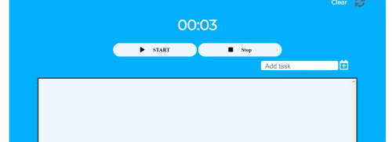

# Counter time for task 

This will add task with timer which that time editable

## Live version 

[Check this link for live version](https://pensive-payne-5bbc0a.netlify.app/)

## Note

1. To delete task click 
2. To edit task time click task and click start
3. to clear all click icon next to cleart